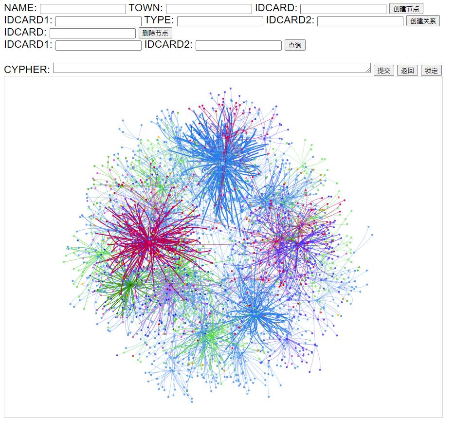

# 一级标题 

## 二级标题

### 三级标题

#### 四级标题

##### 五级标题

###### 六级标题

**加粗**

正文

# **一级标题2**

## 二级标题2

### 三级标题2

#### 四级标题2

##### 五级标题2

###### 六级标题2

**加粗2**

> 引用

[百度](https://www.baidu.com)

[标题](/?id=一级标题)

[test](/test/)

[test1](/test/test1)

[demo1](/demo/demo1)

`代码行`

* 测试

```html
<!-- Theme -->
<link rel="stylesheet" href="https://cdn.jsdelivr.net/npm/docsify-themeable@0/dist/css/theme-simple.css">

<!-- Custom theme stylesheet -->
<link rel="stylesheet" href="theme-custom.css">
```

```java
import org.apache.hadoop.conf.Configuration;
import org.apache.hadoop.fs.FileSystem;
import org.apache.hadoop.fs.Path;

public class HdfsDemo {
    public static void main(String[] args) throws Exception {

        // 创建Configuration实例
        Configuration conf = new Configuration();
        conf.set("fs.defaultFS", "hdfs://linux01:9000");
        conf.set("dfs.replication", "2");
        conf.set("dfs.blocksize", "64M");
        System.setProperty("HADOOP_USER_NAME", "root");
        FileSystem fs = FileSystem.get(conf);
        fs.mkdirs(new Path("/a/b"));
        fs.close();
    }
}
```

```sql
insert into town2login_name
select
t1.dept_id
,t1.town
,t2.login_name
,t2.user_name
from
(
    select
     dept_id
    ,login_name
    ,replace(user_name,'防指','') town
    from sys_user
    where user_name like "%防指%"
    and login_name like "%000"
    group by login_name
) t1
join 
(
    select
     dept_id
    ,login_name
    ,user_name
    from sys_user
    where login_name not like "test%"
    group by login_name
) t2
on t1.dept_id = t2.dept_id
```


<!-- panels:start -->

<!-- div:left-panel -->

Docsify多页设置

Docsify全文检索

<!-- div:right-panel -->

Docsify代码高亮

Docsify代码复制

<!-- panels:end -->


<!-- tabs:start -->

#### **Java**

#### **Scala**

#### **Python**

<!-- tabs:end -->

<!-- tabs:start -->

#### **Java**

#### **Scala**

#### **Python**

<!-- tabs:end -->

```pdf
./基于Django的Neo4j知识图谱系统.pdf
```

> [!NOTE|labelVisibility:hidden|iconVisibility:hidden]
> An alert of type 'note' using global style 'callout'.

> [!NOTE|style:flat|label:My own heading|iconVisibility:hidden]
> An alert of type 'note' using alert specific style 'flat' which overrides global style 'callout'.
>
> In addition, this alert uses an own heading and hides specific icon.

> [!TIP]
> An alert of type 'tip' using global style 'callout'.

> [!WARNING]
> An alert of type 'warning' using global style 'callout'.

> [!ATTENTION]
> An alert of type 'attention' using global style 'callout'.





